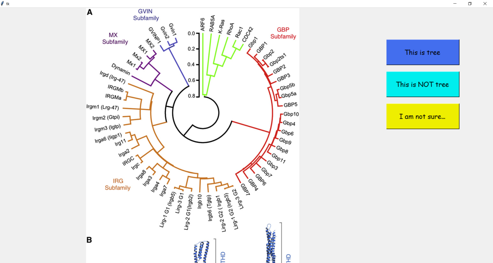

To facilitate building the dataset for tree pictures. I made this GUI where you can press keyboard to classify pictures. 

## To use this GUI
#### Step 1: Create a folder called "UnclassifiedPics". Put all your pictures into this folder.

#### Step 2: Run ClassifyPicByHuman.ipynb in the same directory of that folder.

By default, pictures can be classified into 3 categories:
1. "This is tree" → these pictures will be put into a folder called "Trees" 
2. "This is NOT tree" → these pictures will be put into a folder called "Notrees"
2. "I am not sure" → these pictures will be put into a folder called "IdkAhh"

The above three folders are created by this program. They will be located in the same directory of ClassifyPicByHuman.ipynb.
Below is the interface by runing ClassifyPicByHuman.ipynb:

      
